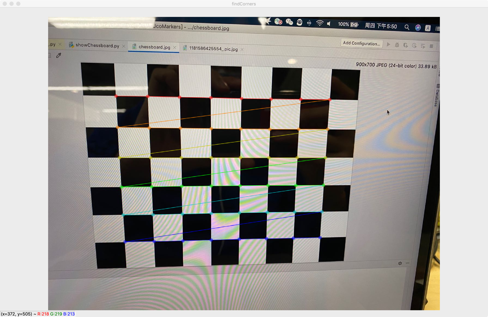

# ArUcoMarkersTools
用于计算摄像头内参与测试ArUcoMarkers

### 项目结构
showChessboard.py ----- 用于生成棋盘格图片
main.py           ----- 计算使用摄像头拍下棋盘格的图片的摄像头的内参(棋盘标定法)

### 棋盘法相机内参获取流程
##### 1.使用showChessboard.py生成棋盘图片
##### 2.使用摄像头拍下棋盘的图片
##### 3.使用main.py计算相机内参
##### 4.下图为棋盘角点计算测试效果

